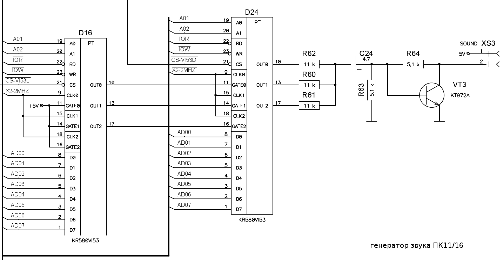

# Звукогенератор ПК11/16

Звукогенератор в ПК11/16 реализован следующим образом:

Используется две микросхемы программируемых таймеров КР580ВИ53,
что позволяет по каждому из трёх звуковых каналов индивидуально
задавать частоту и скважность сигналов (последнее позволяет
управлять громкостью звуковых сигналов).

Вывод OUT1 микросхемы D16 также используется для задания частоты
работы последовательного порта (на рисунке сигнал не показан),
что препятствует одновременному использованию последовательного
порта и звукогенератора.

Описание драйвера звукогенератора из ОС находится в файле [VPSNC1.DOC](VPSNC1.DOC.txt).
Перед отправкой мелодии драйверу её следует преобразовать из текстового представления
(единственный найденный на дисках пример: [MOON.MUS](MOON.MUS)) в бинарный файл
(получится [MOON.SND](MOON.SND), найдены также файлы [ELIZY.SND](ELIZY.SND),
[POLCA.SND](POLCA.SND), [TETRIS.SND](TETRIS.SND) и [TURCA.SND](TURCA.SND)).
Исходный текст конвертора (на макроассемблере) в файле [MML.MAC](MML.MAC),
краткое описание языка описания мелодий: [MML.HLP](MML.HLP.txt).

## Полезные ссылки:
* https://en.wikipedia.org/wiki/Music_Macro_Language
* http://jiggawatt.org/muzak/xpmck/
* https://archeagemmllibrary.com/2ne1-i-dont-care/
* https://games.mail.ru/pc/articles/secret/archeage_kak_napisat_svoi_sobstvennoe_noty_dlja_igry_na_instrumente_by_ds90635_mail_ru/
